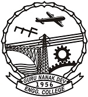

<h1>Computer Science & Engineering Department</h1>

<pre>Ref. No.: CSE/729                                                                                        Dated: 4.12.2020</pre>

<h2>MST-2 Date Sheet</h2>

**INSTRUCTIONS:**
1.	The MST shall be held through guru.gndec.ac.in
2.	The question paper will be comprising of 24 questions (each question carry (01) one mark) and the examination duration will be 20 minutes.
3.	For the open Elective subject student must see the date-sheet of the respective department.

| **Date** | **B.Tech  3rd semester (9:00-9:20)** | **B.Tech  5th semester  (9:00-9:20)** | **B.Tech  7th semester  (9:00-9:20)** | **M.Tech  3rd semester  (11:30-11:50)**|
| 10/12/2020 | Object Oriented Programming (PCCS-101) | Artificial Intelligence (PCCS-108) | Compiler Design (CS-14702) | Data Preparation & Analysis (MCS-155) |
| 11/12/2020 | Computer Networks (PCCS-102) | Database Management Systems (PCCS-109) | Cyber Laws and IPR (CS-14703) | |
| 12/12/2020 | Digital Electronics (ESCS-101) | Formal Language & Automata Theory (PCCS-110) | Cloud Computing (DECS-14706)/ Big Data and Business Analytics(DECS-14707)/ Data Warehouse and Data Mining(DECS-14708) | |
| 14/12/2020 | | Constitution of India (MC1-102) Timing-12.00 to 12.20 am | | |
| 15/12/2020 | Human Values and Professional Ethics (HSMCS-101) | Design and Analysis of Algorithms (PCCS-111) | Natural Language Processing (DECS-14709)/ Machine Learning (DECS-14710)/ Soft Computing(DECS-14713) | |
| 16/12/2020 | Mathematics-III (BSCS-101) | Advanced Computer Networks (PECS-106) | Advanced Computer Networks (CS-14701) | |

[For latest updates check departmental website.](https://cse.gndec.ac.in) 

 
**HOD (CSE)**

		
	

	

